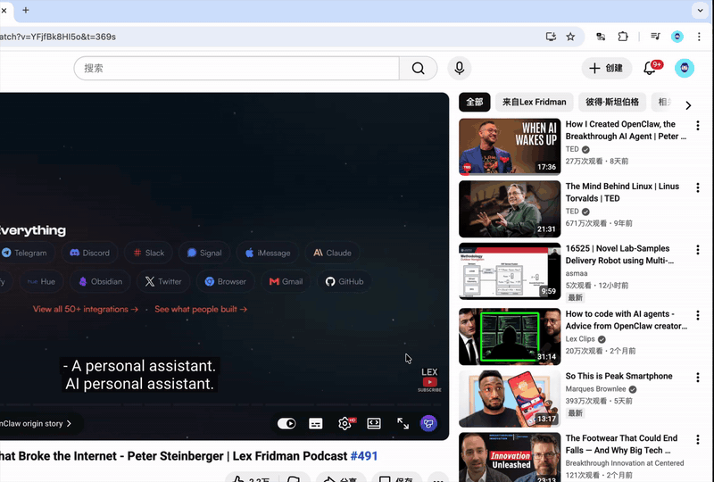
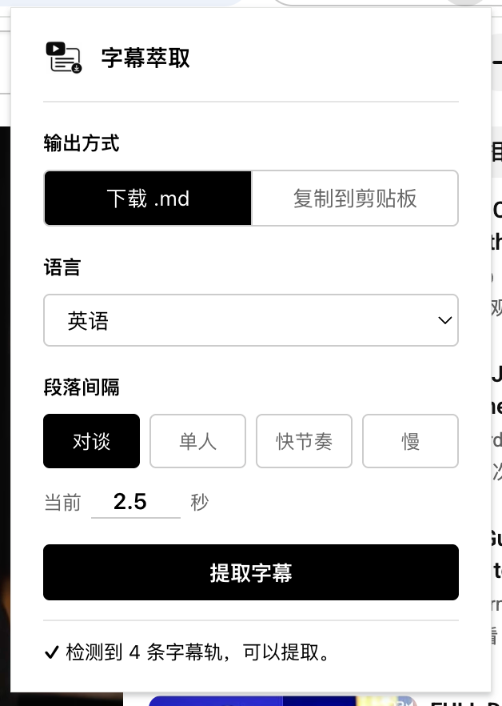
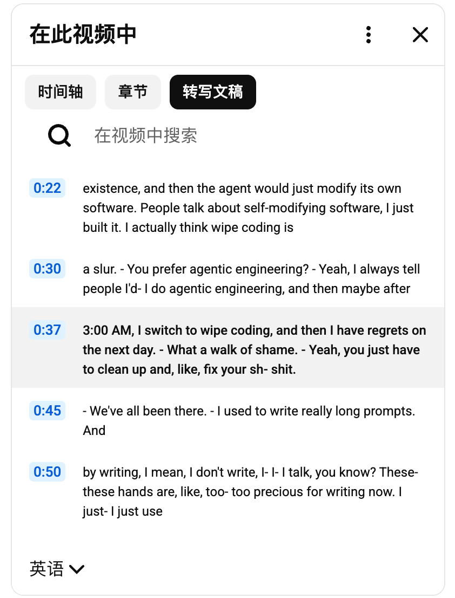
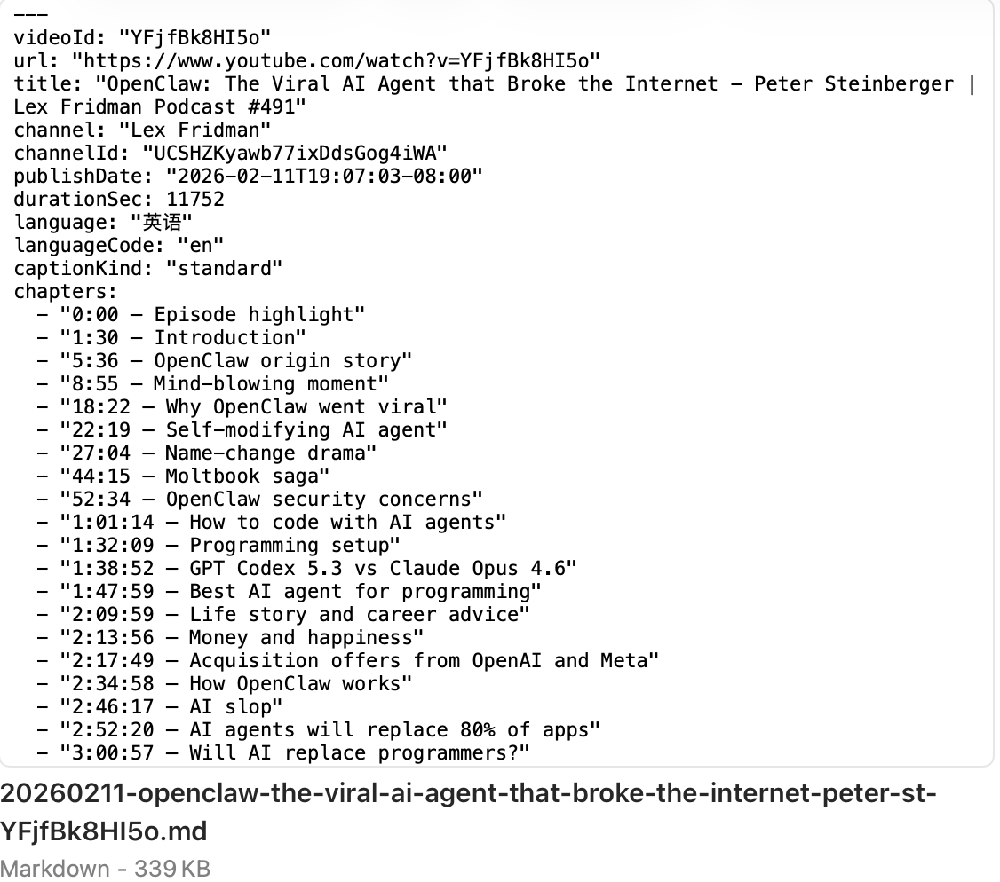

# YouTube 字幕导出为 Markdown

**简体中文** | [English](README.en.md)

[](https://github.com/searchpcc/tube2md/releases)
[](LICENSE)
[](https://github.com/searchpcc/tube2md/actions/workflows/release.yml)

把 YouTube 视频字幕导出成结构化、LLM 友好的 Markdown 文件的 Chrome 扩展——直接喂给 Claude / GPT 等做总结、改写、分析。

支持 English 和 简体中文 —— popup 跟随浏览器 locale 自动切换。

<p align="center">
  
</p>

## 与其它同类扩展的差异

大部分 YouTube 字幕扩展只是把 cue 文本拼成一坨丢给你。这个项目想做的是**真正能被 LLM 用好的输出**：

- **YAML frontmatter 元数据**：频道、频道 ID、发布日期、时长、语言、字幕类型（自动生成 vs 人工上传）、章节列表 —— 全部放在头部，让 LLM 输出有事实依据。
- **章节感知结构**：当 YouTube 自带章节（或创作者在描述里写了 OUTLINE），每个章节会变成 `### 标题`，段落按章节分组。
- **说话人轮次识别**：播客式的 `- ` 说话人切换标记（包括同一 cue 内多次快速切换）会变成段落分隔，对话读起来自然。
- **描述清洗**：赞助商段落、社交链接、与章节重复的 OUTLINE 都会被剥掉，不污染 LLM 的 context budget。
- **功能边界探测**：popup 先探测页面状态；如果视频没有字幕轨，Extract 按钮直接禁用并给出明确提示 —— 不让你白点。
- **自动展开字幕面板**：三段 fallback 兼容 YouTube 各种布局变体；同时支持旧版和新的 "modern transcript view" 渲染器。
- **文件名规整**：下载文件名为 `YYYYMMDD-title-slug-videoId.md` —— 按日期排序、按标题速读、按 ID 唯一。

纯 DOM 抓取。零外部 API 调用。无遥测。页面加载完成后断网也能用。

## 安装（暂时只支持解压加载）

1. clone 或下载本仓库。
2. 浏览器打开 `chrome://extensions`，右上角开 **开发者模式**。
3. 点 **加载已解压的扩展程序**，选本仓库根目录。

每个版本的发布 zip 在 [Releases](../../releases) 页面。

> Chrome Web Store 上架计划中 —— 先攒一些真实使用反馈再走审核。

## 使用

### 快速上手

1. 打开一个 YouTube 视频页面（`youtube.com/watch?v=…`）。
2. 点击扩展图标。popup 会探测页面；只有当视频确实有字幕轨时 **提取字幕** 按钮才会启用。
3. （可选）从 **语言** 下拉里挑一个字幕语言 —— 只在视频有多条字幕轨时才显示。
4. 选 **下载 .md** 或 **复制到剪贴板**，挑一个段落间隔，点 **提取字幕**。

<p align="center">
  
</p>

底部状态行 `检测到 N 条字幕轨，可以提取。` 是绿灯 —— 如果显示红色错误，按钮会保持禁用，错误消息会告诉你怎么处理（刷新页面、手动打开字幕面板等）。popup 语言跟随浏览器 locale（English / 简体中文），上图是 `zh_CN` 浏览器下的截图。

### 各控件说明

- **输出方式** —— `下载 .md` 把文件保存到默认下载文件夹，命名为 `YYYYMMDD-title-slug-videoId.md`。`复制到剪贴板` 把同样的 Markdown 直接写进剪贴板，方便贴进 Claude / ChatGPT 对话框。
- **语言** —— 只在视频有多条字幕轨时显示。默认选英文（人工上传优先于自动生成），其次回落到 YouTube 字幕面板当前显示的语言。自动生成的轨道会在下拉里标 `（自动生成）`。
- **段落间隔** —— 控制 cue 合并成段落的力度。两条 cue 之间静音间隔 **小于这个值** 就合到同一段；超过这个值就开新段。
  - **对谈**（2.5s）—— 默认值；适合播客和访谈这种说话人频繁切换的场景。
  - **单人**（3.5s）—— 单人讲述、讲座、独白。
  - **快节奏**（1.8s）—— 语速快的创作者、新闻、节奏紧凑的 vlog。
  - **慢**（5.0s）—— 节奏慢的科普视频、冥想、ASMR 等。
  - 也可以直接在 **当前** 输入框里手填任意值（0.5–60 秒）。
- **提取字幕** —— 执行抽取。运行过程中状态栏会依次显示 `正在打开字幕面板… → 正在解析 N 段字幕… → 正在合并 N 段… → 正在保存…`，让你知道它没卡住。

### 幕后做了什么

点 提取字幕 之后，注入到 YouTube 标签页的 extractor 会：

1. 如果字幕面板没打开就自动打开。先试描述区下方的 "Show transcript" 按钮，再回退到展开折叠的描述区，最后回退到视频 ⋯ "更多操作" 菜单里的项。
2. （如果选了非默认语言）通过面板里的语言选择器切换字幕轨。
3. 读取面板里的每条 cue，剥掉噪声标记（`[Music]`、`[Applause]`……），识别说话人 dash，按时间戳间隔合并成段落。
4. 从 `getPlayerResponse()` 拿视频元数据（频道、发布日期、时长、章节），拼出最终 Markdown。

extractor 会去读的字幕面板长这样 —— 你不用自己打开它，但调试时认识它会有帮助：

<p align="center">
  
</p>

### 输出预览

一个完整的 `.md` 文件（这里是一期 Lex Fridman 播客）开头是 YAML frontmatter，然后是章节大纲，接着是清洗过的 Description 和按章节分组的 Transcript：

<p align="center">
  
</p>

完整结构：

```markdown
---
videoId: "VIDEO_ID"
url: "https://www.youtube.com/watch?v=VIDEO_ID"
title: "..."
channel: "..."
channelId: "UC..."
publishDate: "2026-04-15T..."
durationSec: 5400
language: "English"
languageCode: "en"
captionKind: "standard"
chapters:
  - "0:00 — Introduction"
  - "5:36 — Origin story"
  - ...
---

# 视频标题

## Description

[视频描述，已剥掉 sponsor / social 段落]

## Transcript

### Introduction

- 第一个发言段落...

- 第二个发言段落...

### Origin story

...
```

接下来就可以喂给你选的 LLM：

```bash
cat 20260415-video-title-VIDEO_ID.md | claude -p "Write a 3-paragraph summary"
```

## 隐私

本扩展不发起任何网络请求。它只读 YouTube 页面已加载好的状态（player response、字幕面板 DOM），全程客户端完成。不向任何第三方服务器发送数据。无遥测。

申请的权限只有 `scripting` + `activeTab` —— 用于在你点击扩展图标时把 extractor 注入当前 YouTube 标签页。host 权限被限制为 `https://www.youtube.com/*`。

完整政策：[PRIVACY.md](PRIVACY.md)。

## 项目结构

```
manifest.json         # MV3 manifest（用 __MSG_*__ 走 i18n）
popup.html / .js      # Popup UI：字幕边界探测、语言选择、分阶段进度反馈
extractor.js          # 注入到 YouTube 页面 MAIN world 执行
icons/                # 16/32/48/64/128/256/512 PNG
_locales/
  en/messages.json    # 默认
  zh_CN/messages.json
.github/workflows/
  release.yml         # 推 v* tag 时构建并发 GitHub Release
docs/screenshots/     # README 用的截图，不会进发布 zip
```

extractor 跑在页面 MAIN world，所以可以直接读 `document.querySelector('#movie_player').getPlayerResponse()`。它访问不到 `chrome.i18n`，因此返回的是错误 **key**（不是已翻译好的字符串），由 popup.js 翻译。

## 开发

没有 build step。改源文件后到 `chrome://extensions` 点扩展卡片上的刷新按钮即可。

坑点：

- `chrome.scripting.executeScript({func})` 通过 `.toString()` 序列化函数注入页面，所以 extractor 必须**完全自包含** —— 不能闭包引用 popup 作用域的符号。所有辅助函数都定义在 `extractAndDeliver` 函数体内。
- `ytd-video-description-transcript-section-renderer` 里的 `ytd-button-renderer` 包裹了真正的 `<button>`。`.click()` 一定要钻到最内层 `<button>` 上 —— 点外层包裹元素是静默无效的。
- 截至 2026 年，YouTube 同时存在两个 segment renderer：旧版 `ytd-transcript-segment-renderer` 和新版 `transcript-segment-view-model`。选择器用逗号 OR 一起匹配（`'old, new'`）以同时兼容。
- 新版 "modern transcript view" 面板的 DOM 里没有语言下拉 —— 这种视频要切换字幕语言得用播放器齿轮 → Subtitles，然后再 extract。

## 发版

通过 `.github/workflows/release.yml` 走 tag 触发：

1. 改 `manifest.json` 里的 `version`。
2. 在 [CHANGELOG.md](CHANGELOG.md) 里加一条记录。
3. `git tag v<version> && git push --tags`。

workflow 会校验 tag 与 `manifest.json` 版本一致，并把 zip 发布到 GitHub Release。

## 贡献

见 [CONTRIBUTING.md](CONTRIBUTING.md)。bug 报告最好附上失败的视频 URL + DevTools 控制台里 `[tube2md]` 标签的日志 —— bug 模板会强制要求这两项。

## 安全

负责任披露请见 [SECURITY.md](SECURITY.md)。

## 许可

MIT。见 [LICENSE](LICENSE)。
